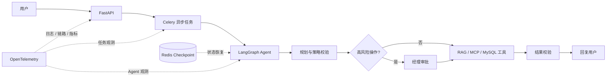

# 企业客服工单 Agent / Customer Support Agent

> ResolveX（内部项目名）：面向订单、物流、退款和政策问答场景的业务 Agent。LLM 负责理解与
> 规划，确定性代码负责权限、幂等、审批和业务状态约束。

客服 Agent 一旦接入订单和退款系统，难点就不再只是“回答得像不像人”，而是如何在模型可能
误判、服务可能中断的情况下，仍然守住权限与业务边界。本项目实现了一条可运行的客服处理链路：
用户用自然语言提出问题，Agent 选择工具并组织步骤，高风险操作交给真人审批，最终结果再由
业务系统校验。

## 核心能力

| 能力 | 解决的问题 |
|---|---|
| **Agent 工具编排与权限控制** | LangGraph 负责规划流程；工具层独立执行参数校验、角色权限、对象归属和幂等控制。 |
| **高风险操作 HITL 审批** | 退款等写操作必须绑定本次动作等待经理审批，批准后仍会重新检查订单状态。 |
| **Celery / Redis 异步执行与故障恢复** | 长任务异步运行并保存检查点；中断后可以恢复，但不会在状态不明时重复写入。 |
| **Context Engineering + Observability + Evaluation** | 按预算组装可信上下文，记录链路与指标，并用版本化数据集验证功能和安全边界。 |

## 关键结果

| 验证项 | 结果 |
|---|---:|
| 真实模型功能用例 | **147/150，任务成功率 98%** |
| 确定性安全用例 | **20/20** |
| 自动化测试 | **288 项通过** |
| 应用代码覆盖率 | **91.02%** |

上述数字分别来自最新完整模型评测报告、确定性安全报告和完整 pytest/coverage 报告。评测运行
绑定数据集、提示词、评分器、提交和模型 fingerprint；详细口径见
[Evaluation / Benchmark](#evaluation--benchmark)与[评测说明](docs/evaluation.md)。

## 代表性业务能力

- 在自由对话中识别订单查询、物流跟踪、取消、退款和政策咨询，无需用户预先选择工单类型；
- 查询当前客户的订单列表、单笔订单状态、物流轨迹和预计送达时间；
- 根据订单归属、履约状态和业务规则决定是否允许取消；
- 校验退款资格，将高风险退款暂停到经理审批，并在完成后从 MySQL 核实真实结果；
- 使用 BGE-M3 + Chroma 从本地政策库检索退款、物流、VIP 和保修规则；
- 通过客户页和运营控制台查看实时进度、取消任务、处理审批与检查失败任务。

## 系统架构



主链路由 FastAPI 接收请求，Celery 执行异步任务，LangGraph 组织推理与工具调用。政策知识通过
RAG 检索，物流与履约能力通过 MCP 服务接入，业务事实保存在 MySQL；Redis checkpoint 和
OpenTelemetry 分别承担恢复与观测，不参与业务授权。

## 关键设计

### 1. LLM 不负责授权

模型负责识别意图和提出计划，但不能直接决定“这个客户能否读取订单”或“这笔退款能否执行”。
每次工具调用都会经过参数校验、角色权限、对象归属、风险等级和幂等检查；对话、RAG 和 MCP
返回的文本都按不可信输入处理。

### 2. 高风险动作必须审批

退款审批绑定具体运行、工具、订单、金额、原因和动作指纹，不是一个可复用的放行开关。恢复
执行前系统会重新读取当前业务状态，因此过期审批或被修改的参数不能绕过检查。

### 3. 异步任务可恢复，但不能盲目重放

业务事实存入 MySQL，Agent 进度存入独立 Redis checkpoint。任务中断后只有在检查点和状态
一致时才继续；如果执行进度无法证明，系统转交人工检查，而不是猜测上次执行到了哪里。

### 4. 上下文与失败重规划受到预算和权限约束

ContextAssembler 优先保留安全规则、当前请求、业务事实和工具契约，再裁剪历史消息、记忆与
政策片段。执行失败后先 Verify → Diagnose；只有只读操作的临时依赖故障或结果不一致可以在
固定次数内重新规划，写操作、越权和业务拒绝不会自动重放。

## 技术栈

| 关注点 | 技术 |
|---|---|
| Agent 与模型 | Python 3.12、LangGraph、OpenAI-compatible LLM API |
| API 与数据 | FastAPI、Pydantic、SQLAlchemy、Alembic、MySQL 8.4 |
| RAG 与工具接入 | BGE-M3、Chroma、MCP |
| 异步与恢复 | Celery、Redis、LangGraph Redis Checkpoint |
| 可观测性 | OpenTelemetry、Jaeger、Prometheus、Grafana |
| 质量保障 | Pytest、Ruff、pip-audit、GitHub Actions |

## Quick Start

### 1. 环境要求

- Docker Desktop / Docker Engine；
- 一个兼容 OpenAI Chat Completions 的模型 API Key；
- 已下载到本机的 `BAAI/bge-m3` 模型缓存。

### 2. 配置 `.env`

```powershell
Copy-Item .env.example .env
```

至少填写 `MYSQL_PASSWORD`、`MYSQL_ROOT_PASSWORD`、`JWT_SECRET`、`LLM_API_KEY`、
`LLM_BASE_URL`、`LLM_MODEL` 和 `BGE_MODEL_CACHE_HOST`。字段说明及 JWT 生成方式见
[完整部署指南](docs/setup.md)。

### 3. 启动服务

```powershell
docker compose up -d --build
```

### 4. 初始化数据库与政策索引

```powershell
docker compose exec api alembic upgrade head
docker compose exec api python -m scripts.seed_demo
docker compose exec api python -m scripts.index_policies --query "delayed shipment" --policy-type shipping
```

### 5. 验证 Golden Path

```powershell
docker compose exec -T api python -m scripts.verify_golden_path `
  --api-url http://127.0.0.1:8000 `
  --timeout 180
```

该脚本会完整验证“客户申请退款 → 等待经理审批 → 恢复执行 → 校验退款与幂等记录”的链路，
并调用 `.env` 配置的真实模型。启动后可访问客户页 <http://localhost:8000/chat>、运营控制台
<http://localhost:8000/operator> 和 Swagger <http://localhost:8000/docs>。

Conda 环境、BGE 缓存、JWT、Docker 缓存、手工演示和本地测试命令均已移至
[docs/setup.md](docs/setup.md)。

## Evaluation / Benchmark

最新完整评测运行于提交 `c2f6b60`，使用 `p1-functional-v2+security-v1` 数据集、
`agent-workflow-v4` 提示词和 `fixture-runtime-scorer-v4+category-gate-v1` 评分配置。请求与返回
模型均为 `deepseek-flash`，供应商 fingerprint 与基线一致，因此报告标记为可比较。

| 指标 | 结果 |
|---|---:|
| 功能用例 | 150 |
| 任务成功率 | 98%（147/150） |
| 意图识别准确率 | 99.33% |
| 实体提取准确率 | 97.95% |
| 工具选择 / 参数 / 顺序准确率 | 98% / 98.67% / 98% |
| 业务类别门槛 | 7/7 通过；最低类别为多轮对话 90% |
| 安全控制成功率 | 100%（20/20） |
| 越权执行 / 审批绕过 / 跨用户泄露 / 重复动作 | 0 / 0 / 0 / 0 |

质量 gate 要求总体任务成功率不低于 80%、工具选择准确率不低于 90%，每个业务类别也分别
执行相同门槛；四类关键安全事件实行零容忍。查看
[GitHub Real-model gate #9](https://github.com/foolishsanjiu/Customer_Support_Agent/actions/runs/35313794544)、
[完整评测说明](docs/evaluation.md)和[历史基线](docs/evaluation-baseline.md)。

普通 CI 不调用付费模型，负责 lint、迁移、288 项自动化测试、90% 覆盖率门槛和确定性安全
回归。作为本次文档重构依据的
[GitHub CI #21](https://github.com/foolishsanjiu/Customer_Support_Agent/actions/runs/35316812074)
已通过。

## 项目结构

| 路径 | 职责 |
|---|---|
| `app/agent/` | LangGraph 工作流、状态与运行守卫 |
| `app/context/` | 上下文预算、可信级别与裁剪规则 |
| `app/tool_runtime/` | 工具注册、授权、幂等、执行与审计 |
| `app/policy/`、`app/memory/` | 政策 RAG、摘要与客户级语义记忆 |
| `app/approvals/` | 人工审批生命周期与动作绑定 |
| `app/worker/` | Celery 执行、恢复与定时对账 |
| `app/mcp/` | 物流与履约 MCP 服务 |
| `app/chat/`、`app/operator/` | 客户体验页与运营控制台 |
| `app/evaluation/`、`evals/` | 数据集、评分器、门槛与版本化基线 |
| `tests/` | 单元、集成、安全、部署与性能测试 |

## 详细文档

- [完整部署与本地验证](docs/setup.md)
- [评测方法、结果与证据](docs/evaluation.md)
- [上下文组装与受限修复闭环](docs/context-and-repair-loop.md)
- [退款执行边界](docs/adr/0001-refund-execution-boundary.md)
- [审批与具体动作绑定](docs/adr/0002-approval-binds-material-action.md)
- [MySQL / Redis 故障恢复](docs/adr/0003-mysql-redis-transition-recovery.md)
- [客户聊天页](docs/customer-chat.md)与[运营控制台](docs/operator-console.md)
- [10 分钟演示手册](docs/demo-guide.md)
- [P1 完成审计](docs/p1-completion-audit.md)与[性能测试说明](docs/performance-testing.md)

当前目标是单机 Docker Compose 下的可验证业务闭环，不包含完整客服坐席系统、Kubernetes
部署或线上容量承诺。真实模型结果用于同一数据集和模型身份下的回归比较，不代表未见流量上
的绝对正确率。
