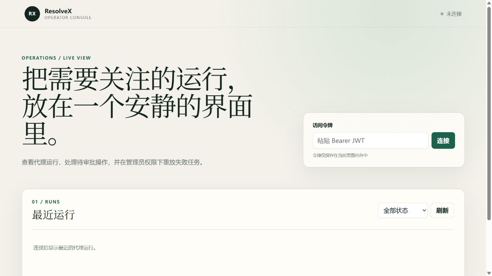
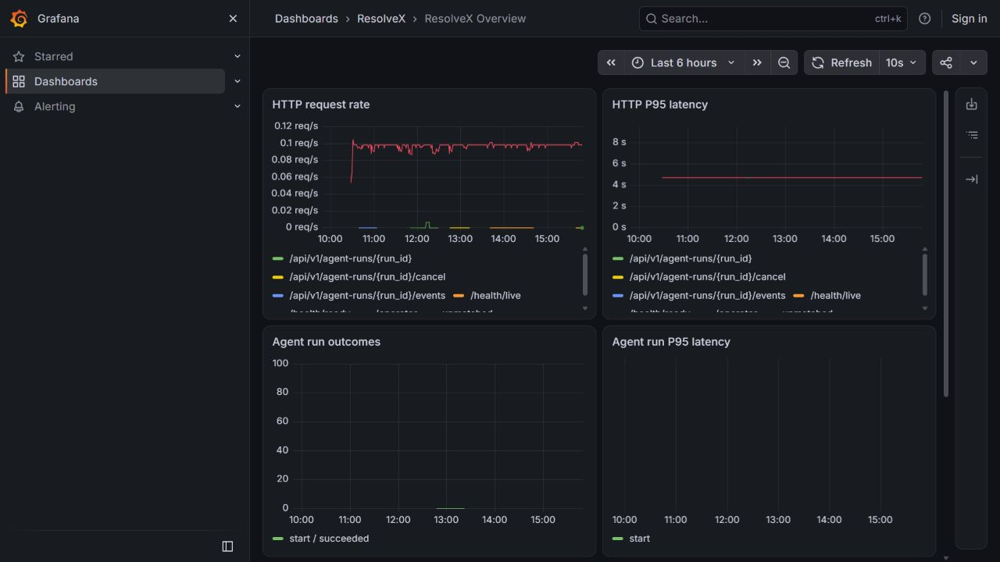
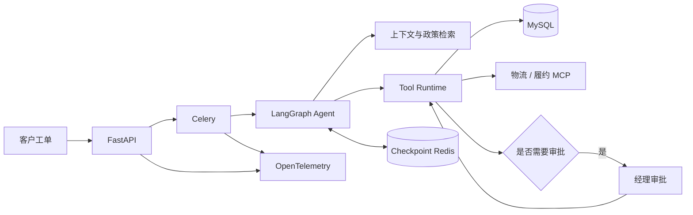

# ResolveX

> 一个会调用业务系统、但不能越权替用户做决定的客服 Agent 后端。

ResolveX 处理订单查询、物流跟踪、取消订单、退款和政策问答。用户在客户对话中直接描述问题后，
LLM 负责理解问题和生成执行计划；真正的查库、鉴权、审批、幂等和状态校验由确定性代码
完成。这样即使模型判断失误，也不能绕过业务规则直接退款，或读取其他客户的数据。

这个项目关注的不是“让聊天更像真人”，而是客服 Agent 真正接入业务系统后必须面对的
问题：长任务如何恢复，高风险操作如何审批，外部服务失败后如何降级，以及怎样证明一次
改动没有破坏安全边界。

## 项目状态

P0 和 P1 已完成，当前实现包含完整业务链路、异步执行、人工审批、故障恢复、可观测性、
安全回归、真实模型评测，以及一个用于跑通客户侧流程的小型聊天页。

| 验证项 | 当前结果 |
|---|---:|
| 自动化测试 | 272 项通过 |
| 应用代码覆盖率 | 90.73% |
| 真实模型功能评测 | 147/150，任务成功率 98% |
| 工具选择准确率 | 98% |
| 确定性安全评测 | 20/20 |
| 关键安全事件 | 0 |

以上真实模型结果来自提交 `95daf5a` 的受保护 GitHub Actions benchmark。模型、供应商指纹、
数据集和评分器都会写入报告，避免把模型版本变化误判为代码回归。完整证据见
[P1 完成审计](docs/p1-completion-audit.md)和[评测基线说明](docs/evaluation-baseline.md)。

## 界面预览

客户聊天页用于提交问题并查看 Agent 处理进度；运营控制台用于查看 AgentRun、处理审批和
重放 DLQ；监控面板展示 HTTP、Agent 和外部依赖指标。截图来自本地合成数据环境，不包含
真实客户信息或访问令牌。





## 能做什么

- 查询自己的订单总数与订单列表，以及单个订单状态、物流轨迹和预计送达时间；
- 核实指定订单或最近一笔退款的真实状态，不依赖聊天历史猜测；
- 根据订单归属和当前状态取消订单；
- 校验退款资格，高风险退款必须等待经理审批；
- 从本地政策库回答退款、物流、VIP 和保修问题；
- 在轻量客户页中自由创建对话、发送消息并实时查看 AgentRun 进度；
- 让每条客户消息绑定独立 AgentRun；明确的新意图覆盖历史，运行按对话串行排队；
- 对“谢谢”“好的”“再见”等独立社交消息使用确定性短回复，不重新判断已完成业务；
- 在信息缺失、跨用户访问或非法状态下拒绝执行或要求补充信息；
- 通过 SSE 查看任务进度，在安全边界处取消长任务；
- 对失败任务进入 DLQ，由管理员检查并按原幂等键重放；
- 在 Jaeger、Prometheus 和 Grafana 中查看链路、指标和故障状态。

一个退款请求大致会经过下面这条路径：



## 关键设计

### LLM 不负责授权

模型只负责意图识别和规划。所有工具调用都要经过注册表、参数校验、角色权限、对象归属、
风险等级、幂等、执行后验证和审计。来自对话、RAG 或 MCP 的文本都按不可信输入处理。

### 审批绑定具体动作

L3 退款审批绑定 AgentRun、工具调用、参数快照和指纹。恢复执行前会再次检查订单状态、归属、
退款资格和审批有效性，旧审批不能被挪到另一笔退款上使用。设计过程见
[ADR 0001](docs/adr/0001-refund-execution-boundary.md)和
[ADR 0002](docs/adr/0002-approval-binds-material-action.md)。

### 任务可以恢复，但不会盲目重放

Agent 状态保存在独立的 Redis checkpoint 实例中，业务事实保存在 MySQL。Celery 重试、
定时对账、运行状态守卫和 DLQ 一起处理“数据库已提交但消息未发出”等故障窗口。缺少合法
checkpoint 的历史任务会标记为需要人工处理，而不是猜测执行进度。

### 组件是按问题加入的

项目没有为了展示技术栈而强行拆成微服务。MySQL 负责业务一致性，Redis 分别承担队列/控制
状态和 LangGraph checkpoint；MCP 只用于明确的外部物流与履约边界。缓存和分布式锁经过
性能与正确性分析后没有加入，相关取舍记录在 [P1 完成审计](docs/p1-completion-audit.md)。

## 技术栈

- Python 3.12、FastAPI、Pydantic、SQLAlchemy、Alembic
- LangGraph、OpenAI-compatible LLM API、BGE-M3、Chroma
- Celery、Redis、MySQL 8.4
- MCP、OpenTelemetry、Jaeger、Prometheus、Grafana
- Pytest、Ruff、pip-audit、GitHub Actions

## 快速部署

下面的命令以 Windows PowerShell 为例。MySQL 和 Redis 都由 Docker Compose 启动，不需要
在 Windows 中单独安装。

### 1. 准备环境

需要：

- Docker Desktop，且 Docker Engine 已启动；
- Conda；
- 一个兼容 OpenAI Chat Completions 的模型 API Key；
- BGE-M3 模型的本地缓存。

创建 Python 3.12 环境并安装锁定依赖：

```powershell
conda create --prefix D:\CondaEnvs\resolvex python=3.12 -y
conda activate D:\CondaEnvs\resolvex
python -m pip install -r requirements-dev.lock
python -m pip install --no-deps -e .
```

如果本机还没有 BGE-M3，可在允许访问 Hugging Face 的环境中下载一次：

```powershell
python -c "from sentence_transformers import SentenceTransformer; SentenceTransformer('BAAI/bge-m3', cache_folder=r'D:\CondaEnvs\resolvex\models')"
```

容器运行时使用离线模式，不会在启动过程中偷偷下载模型。若缓存放在其他位置，后面把
`BGE_MODEL_CACHE_HOST` 改成实际路径即可。

### 2. 配置环境变量

```powershell
Copy-Item .env.example .env
python -c "import secrets; print(secrets.token_urlsafe(48))"
```

将第二条命令生成的值写入 `.env` 的 `JWT_SECRET`，并至少检查以下配置：

```dotenv
MYSQL_PASSWORD=请设置本地密码
MYSQL_ROOT_PASSWORD=请设置另一个本地密码
JWT_SECRET=刚才生成的随机值
LLM_API_KEY=模型供应商密钥
LLM_BASE_URL=https://api.deepseek.com
LLM_MODEL=deepseek-flash
BGE_MODEL_CACHE_HOST=D:/CondaEnvs/resolvex/models
GRAFANA_ADMIN_PASSWORD=请设置本地密码
```

`.env` 已被 Git 忽略。不要把真实密钥写入 `.env.example` 或提交记录。

### 3. 启动服务

```powershell
docker compose config --quiet
docker compose up -d --build
docker compose exec api alembic upgrade head
docker compose exec api python -m scripts.seed_demo
docker compose exec api python -m scripts.index_policies --query "delayed shipment" --policy-type shipping
python -m scripts.verify_deployment
```

首次构建需要安装 Python 依赖，时间取决于网络和 Docker 缓存。`seed_demo` 会创建 100 个
客户、300 个订单和 24 个工单；重复执行不会重复插入。

启动成功后可以访问：

| 地址 | 用途 |
|---|---|
| <http://localhost:8000/docs> | Swagger API 文档 |
| <http://localhost:8000/chat> | 小型客户聊天页 |
| <http://localhost:8000/operator> | 轻量运营控制台 |
| <http://localhost:16686> | Jaeger 链路查询 |
| <http://localhost:9090> | Prometheus |
| <http://localhost:3000> | Grafana `ResolveX Overview` |

健康检查：

```text
GET http://localhost:8000/health/live
GET http://localhost:8000/health/ready
```

### 4. 跑通一条真实业务链路

下面的脚本会创建隔离的客户和已送达订单，发起退款 AgentRun，等待经理审批，恢复任务并
核对退款、幂等、审计和 checkpoint。成功后会清理测试数据；失败时保留现场并打印相关 ID。

```powershell
docker compose exec -T api python -m scripts.verify_golden_path `
  --api-url http://127.0.0.1:8000 `
  --timeout 180
```

这一步会调用 `.env` 中配置的真实模型并消耗少量额度。日常调试也可以通过 Swagger 创建
工单和 AgentRun；业务接口使用 Bearer JWT，角色分为 `CUSTOMER`、`SUPPORT_AGENT`、
`MANAGER` 和 `ADMIN`。

### 5. 在浏览器中体验客户与审批流程

下面的令牌只用于本机演示，默认有效期为 15 分钟。客户令牌只能用于客户页；经理和管理员
令牌用于运营控制台。如果把客户令牌粘贴到运营控制台，页面会提示“令牌不包含有效的运营
角色”，这是正常的权限隔离。

生成客户 1 的 JWT：

```powershell
docker compose exec -T api python -c "from app.core.config import get_settings; from app.models.enums import PrincipalRole; from scripts.verify_golden_path import create_jwt; print(create_jwt(get_settings(), subject='demo-customer-1', role=PrincipalRole.CUSTOMER, customer_id=1))"
```

生成经理 JWT：

```powershell
docker compose exec -T api python -c "from app.core.config import get_settings; from app.models.enums import PrincipalRole; from scripts.verify_golden_path import create_jwt; print(create_jwt(get_settings(), subject='local-manager', role=PrincipalRole.MANAGER))"
```

生成管理员 JWT：

```powershell
docker compose exec -T api python -c "from app.core.config import get_settings; from app.models.enums import PrincipalRole; from scripts.verify_golden_path import create_jwt; print(create_jwt(get_settings(), subject='local-admin', role=PrincipalRole.ADMIN))"
```

| 角色 | 使用入口 | 主要权限 |
|---|---|---|
| `CUSTOMER` | <http://localhost:8000/chat> | 查看自己的对话、提问、创建 AgentRun、取消自己的运行 |
| `MANAGER` | <http://localhost:8000/operator> | 查看运行、取消运行、批准或拒绝退款 |
| `ADMIN` | <http://localhost:8000/operator> | 拥有经理能力，并可查看和重放 DLQ 失败任务 |

客户页和运营控制台都只把 JWT 保存在当前页面内存中，刷新页面后令牌即被清除。

#### 手动完成一次退款

1. 在全新 `seed_demo` 数据中，将客户 JWT 粘贴到客户页，创建对话并输入
   “订单 2 不想要了，我要退款”；
2. 等待 AgentRun 进入 `WAITING_APPROVAL`；
3. 将经理或管理员 JWT 粘贴到运营控制台；
4. 在“待审批”区域填写审批理由，然后点击“批准”或“拒绝”；
5. 批准后观察状态从 `RESUME_PENDING` 继续到 `SUCCEEDED`；
6. 回到客户页查看结果，并输入“订单 2 的退款成功了吗”再次从 MySQL 核实。

审批不是一个可以复用的“放行开关”。它绑定本次 AgentRun、工具调用、订单、金额、退款原因
和动作指纹；批准后仍会重新检查订单归属及状态。即使使用管理员 JWT，也不能跳过这条链路
直接退款。

在客户页中可以直接询问“订单 2 的退款成功了吗”或“刚才的退款成功了吗”。前者查询指定
订单，后者查询当前 JWT 客户最近一笔退款；两种查询都以 MySQL 当前状态为准。退款完成后
输入“谢谢你”，系统只会返回简短致谢，不会因为新一轮没有工具调用而否定上一轮结果。

完整页面行为和安全边界见[客户聊天页说明](docs/customer-chat.md)与
[运营控制台说明](docs/operator-console.md)。

### 6. 停止服务

```powershell
docker compose down
```

这会停止容器但保留 MySQL、Redis、Chroma、Prometheus 和 Grafana 数据卷。只有明确希望
删除本地数据时才使用 `docker compose down -v`。

## 本地开发与验证

代码风格和单元测试：

```powershell
ruff check .
ruff format --check .
pytest
```

完整集成测试需要正在运行的 MySQL、Redis 和 checkpoint Redis：

```powershell
$env:DATABASE_URL = "mysql+asyncmy://resolvex:<MYSQL_PASSWORD>@127.0.0.1:3306/resolvex"
$env:LANGGRAPH_REDIS_URL = "redis://127.0.0.1:6380/0"
$env:CONTROL_REDIS_URL = "redis://127.0.0.1:6379/2"
$env:RUN_INTEGRATION_TESTS = "1"
pytest --cov=app --cov-report=term-missing --cov-fail-under=90
```

其中 `<MYSQL_PASSWORD>` 替换为 `.env` 中的实际值；这里显式覆盖容器服务名，是因为测试进程
运行在 Windows 宿主机上。

普通 CI 不调用付费模型；它执行 lint、迁移、完整测试、90% 覆盖率门槛和 20 条确定性安全
回归。真实模型测试位于独立的 `Real-model gate` 工作流中，`smoke` 运行 7 条代表性用例，
`benchmark` 运行 150 条功能用例和 20 条安全用例。

性能测试同样不消耗模型额度：

```powershell
python -m scripts.run_load_test `
  --path /health/ready `
  --requests 500 `
  --concurrency 10 `
  --output artifacts/load-ready.json
```

基准环境、P50/P95/P99 和结果边界见[性能测试说明](docs/performance-testing.md)。

## 代码导航

| 路径 | 内容 |
|---|---|
| `app/agent/` | LangGraph 工作流、状态和运行守卫 |
| `app/tool_runtime/` | 工具注册、权限、幂等、执行与审计 |
| `app/policy/` | 政策检索和确定性风险决策 |
| `app/approvals/` | 审批生命周期与动作绑定 |
| `app/worker/` | Celery 执行、恢复和定时任务 |
| `app/mcp/` | 物流与履约 MCP 服务 |
| `app/chat/` | 无前端依赖的客户聊天页 |
| `app/operator/` | 运行查看、退款审批和 DLQ 操作台 |
| `app/evaluation/`、`evals/` | 数据集、评分器、门槛和基线 |
| `tests/security/` | 越权、注入、审批绕过和重复执行回归 |
| `docs/adr/` | 关键架构决策记录 |

## 如果只想快速了解项目

建议按这个顺序阅读：

1. [P1 完成审计](docs/p1-completion-audit.md)：项目做到了什么，哪些功能有意没做；
2. [退款执行边界 ADR](docs/adr/0001-refund-execution-boundary.md)：为什么不能让模型直接写业务状态；
3. [审批动作绑定 ADR](docs/adr/0002-approval-binds-material-action.md)：如何防止审批被复用或篡改；
4. [MySQL/Redis 恢复 ADR](docs/adr/0003-mysql-redis-transition-recovery.md)：跨存储故障窗口如何处理；
5. [评测基线](docs/evaluation-baseline.md)：真实模型结果如何比较，为什么不是追求表面上的 100%。

如果需要现场展示，可直接使用 [10 分钟演示手册](docs/demo-guide.md)。准备 GitHub Release
时可复用 [v0.1.0 发布说明](docs/release-notes-v0.1.0.md)。

## 已知边界

- 当前部署目标是单机 Docker Compose，不声称具备 Kubernetes 生产容量；
- 客户聊天页用于核心链路演示，不包含账号系统、附件、富文本和客服坐席协同；
- 运营控制台用于审批、运行状态和 DLQ 操作，不是完整客服工作台；
- BGE-M3 需要预先放入本地缓存，容器默认禁止运行时下载；
- 真实模型输出存在波动，因此报告必须绑定提交、数据集、提示词版本和供应商指纹；
- 性能数据用于同环境回归比较，不等同于线上 SLA 或容量承诺。

这些限制是当前项目边界的一部分。P2 中的 episodic memory、500+ 评测集、大型前端、
微服务拆分和 Kubernetes 都是可选项，只有出现明确需求和可验证收益时才值得继续加入。
