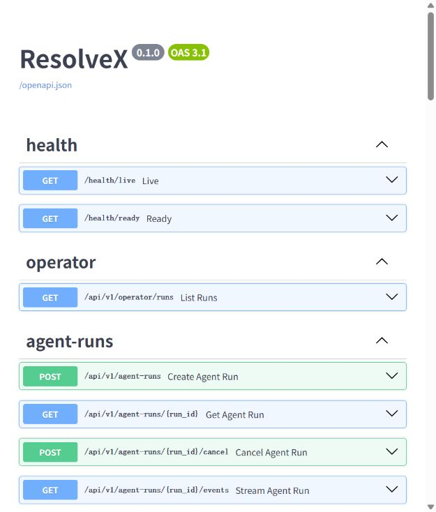

# ResolveX 10 分钟演示手册

这份手册用于面试、代码评审或项目交接。目标不是把所有组件都点一遍，而是用一条退款链路
说明 ResolveX 如何把模型能力放进可恢复、可审批、可审计的业务系统。

## 演示前检查

提前启动服务并完成迁移、种子数据和政策索引：

```powershell
docker compose up -d
docker compose exec api alembic upgrade head
docker compose exec api python -m scripts.seed_demo
docker compose exec api python -m scripts.index_policies --query "delayed shipment" --policy-type shipping
python -m scripts.verify_deployment
```

确认 `http://localhost:8000/health/ready` 返回就绪。现场演示前不要执行
`docker compose down -v`，它会删除本地数据卷。

## 推荐讲解顺序

### 0:00–1:00：先讲问题，不先报技术栈

打开项目 README，说明 ResolveX 处理订单、物流、取消、退款和政策问答。核心约束是：LLM
可以理解和规划，但不能直接授权、越权查数据或写业务状态。

一句话版本：

> 这是一个把客服对话转换为可审计业务动作的 Agent 后端，模型负责判断，确定性代码负责
> 权限、审批和最终执行。

### 1:00–3:00：用退款链路解释架构

沿 README 架构图说明：

1. FastAPI 接收工单并创建 AgentRun；
2. Celery 异步执行 LangGraph；
3. Context Builder 合并 MySQL 事实、政策检索和客户级记忆；
4. Tool Runtime 再做角色、归属、风险、幂等和参数校验；
5. L3 退款暂停等待经理审批，恢复前重新检查状态；
6. checkpoint、运行守卫和 DLQ 处理崩溃与重放；
7. OpenTelemetry 把 API、Celery、LLM、MCP 和工具链路串起来。

这里最值得强调的是：MySQL 是业务事实来源，Redis checkpoint 只是执行状态，模型输出和
RAG/MCP 文本都不是授权依据。

### 3:00–6:00：运行一条端到端退款

```powershell
docker compose exec -T api python -m scripts.verify_golden_path `
  --api-url http://127.0.0.1:8000 `
  --timeout 180
```

脚本会自动完成以下动作：

- 创建隔离客户、已送达订单和退款工单；
- 以客户身份创建 AgentRun；
- 等待工作流进入 `WAITING_APPROVAL`；
- 以经理身份批准绑定到具体参数的动作；
- 从 Redis checkpoint 恢复；
- 验证退款、审计、幂等和最终回复；
- 成功后清理临时业务数据和 checkpoint。

这一步会调用真实模型。网络或供应商状态不适合现场调用时，不要反复重试；改用评测证据和
下方截图讲解即可。

### 6:00–8:00：展示操作面和可观测性

打开以下页面：

- Swagger：<http://localhost:8000/docs>
- 运营控制台：<http://localhost:8000/operator>
- Jaeger：<http://localhost:16686>
- Grafana：<http://localhost:3000>




如需演示运营台的角色视图，可在本机生成一个 15 分钟有效的合成管理员 JWT：

```powershell
docker compose exec -T api python -c "from app.core.config import get_settings; from app.models.enums import PrincipalRole; from scripts.verify_golden_path import create_jwt; print(create_jwt(get_settings(), subject='demo-admin', role=PrincipalRole.ADMIN))"
```

只把它粘贴到本机 `localhost:8000/operator`，演示结束后刷新页面。不要录制、提交或发送该
令牌；控制台本身也不会把令牌写入 Cookie、localStorage 或 sessionStorage。

### 8:00–10:00：用证据收尾

打开 [P1 完成审计](p1-completion-audit.md)和[评测基线](evaluation-baseline.md)：

- 251 项自动化测试，覆盖率 90.57%；
- 150 条真实模型功能用例，任务成功率和工具选择准确率均为 98%；
- 20 条确定性安全用例全部通过；
- 跨用户访问、审批绕过、重复业务动作等关键安全事件为 0；
- 真实模型报告绑定 Git SHA、数据集、提示词、评分器和供应商指纹。

最后主动说明项目边界：当前目标是单机 Docker Compose，不把本地性能基准包装成线上 SLA，
也没有为了简历堆栈而提前拆微服务或加入 Kubernetes。

## 常见追问

### 为什么不让模型直接决定退款？

模型输出不稳定，也无法替代订单归属、状态和审批规则。ResolveX 把模型决策限制在意图识别
和规划层，真实写操作必须经过 Tool Runtime，并在执行前重新校验。

### 为什么 MySQL 和 Redis 都保存状态？

两者保存的不是同一种状态。MySQL 保存订单、退款、审批和审计等业务事实；Redis 保存队列、
限流和 LangGraph 执行 checkpoint。恢复时以 MySQL 为准，并验证 checkpoint 是否仍然合法。

### 为什么评测不是 100%？

真实模型 benchmark 有 3 条模型质量失败，但所有业务类别仍通过冻结门槛，安全控制为 20/20。
项目保留失败组成和供应商指纹，而不是为得到漂亮数字反复调提示词或隐藏样本。

### 为什么没有应用缓存和分布式锁？

负载测试没有发现值得缓存的明确瓶颈；事务、唯一约束、幂等和状态校验已经保证正确性。
Redis 锁只能减少竞争，不能成为正确性的唯一来源，因此当前没有增加这一层复杂度。

## 无法联网时的备用方案

如果模型 API 临时不可用：

1. 不运行 golden path；
2. 展示本页三张截图和版本化评测报告；
3. 运行 `pytest tests/security/test_security_regression.py -q` 展示确定性安全控制；
4. 说明真实模型调用被刻意放在独立、手动触发的 GitHub Actions workflow 中。

这样仍然可以完整讲清架构与安全边界，又不会把外部供应商波动伪装成项目故障。
